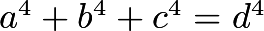

# C++ Interview Question
This is the equation:

The code in `main.cpp` will find all values matches this equation for

    1<a<100000,
    1<b<300000,
    1<c<500000  and
    1<d<500000.

Optimize this code.

For testing your code use these values:

    a = 95800
    b = 217519
    c = 414560
    d = 422481